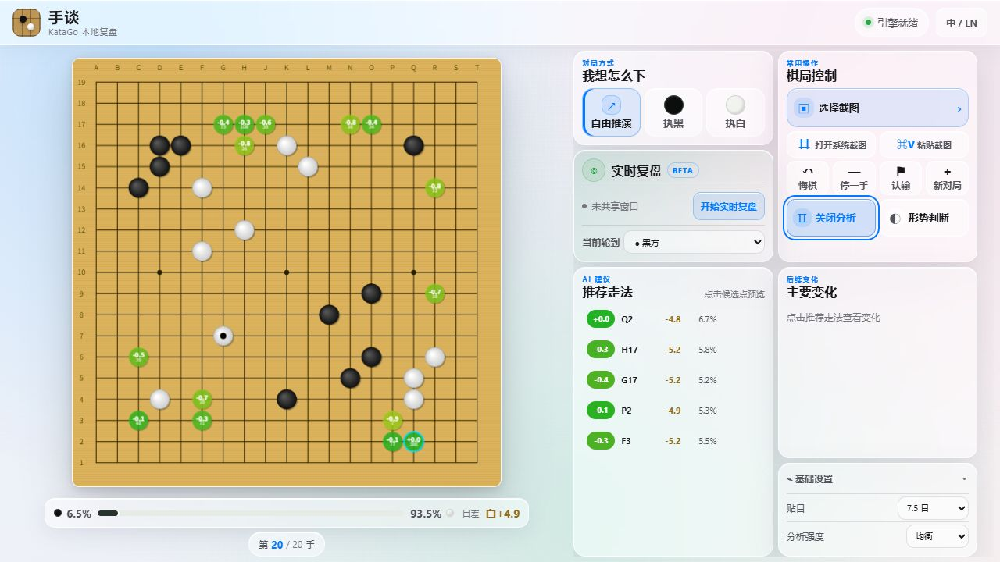
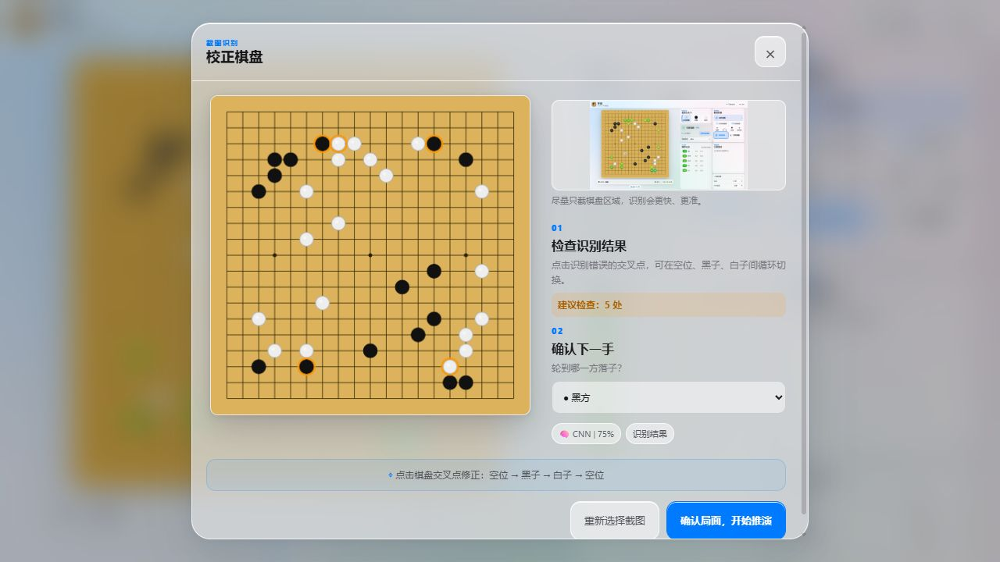

# 手谈 · KataGo HandTalk

[](https://github.com/aredddd/katago-handtalk/actions/workflows/ci.yml)


[](LICENSE)

面向围棋新手的本地 KataGo 复盘工具。常用对局操作、截图导入、近实时棋盘识别和
AI 推演都放在一个桌面窗口里；服务只监听 `127.0.0.1`，棋谱、截图和分析数据默认
留在本机。



## 快速开始：Windows 桌面版

`v0.1.0-beta.2` 推荐直接使用 GitHub Release 的便携 ZIP，不需要安装 Git、Node.js
或系统 Python。

1. 打开 [GitHub Releases](https://github.com/aredddd/katago-handtalk/releases)，下载
   `KataGo-HandTalk-0.1.0-beta.2-windows-x64.zip` 和同一 Release 中的
   `SHA256SUMS`。
2. 完整解压 ZIP；不要只从压缩包预览窗口运行 EXE，也不要移动或删除同目录的
   `_internal`、`app` 和 `licenses`。
3. 双击 `KataGo-HandTalk.exe`。
4. 在首次配置中选择本机的 KataGo 可执行文件和棋力网络。分析配置可直接使用包内
   默认配置，也可选择自己的 KataGo analysis 配置。
5. 截图识别是可选功能。没有识图权重、没有 CUDA，或只想先开始复盘时，选择关闭
   识图并继续；基础对局和 KataGo 分析不受影响。

发行包不包含 KataGo、棋力网络或截图识别权重，用户需从有权使用的来源自行取得。
首次运行会联网下载经过版本与哈希约束的 `uv`、Python 3.11.16 和所选依赖。程序把
可写配置与运行环境放在：

```text
%LOCALAPPDATA%\KataGoHandTalk\
├─ settings.json
├─ preferences.json
├─ practice-progress.json
├─ logs\
└─ runtime\
```

因此可以把 Release 解压目录放在普通只读位置，更新时也不必复制 `.venv`。之后可从
应用内“重新配置”修改 KataGo、棋力网络、分析配置或识图设置；保存后会重启本地
后端，当前尚未保存的推演可能丢失。

> 当前 beta 尚未进行 Authenticode 签名，Windows SmartScreen 可能显示警告。请只从
> 本项目 Release 下载并先核对 `SHA256SUMS`。Windows 10 还需要 Microsoft Edge
> WebView2 Runtime；Windows 11 通常已预装。

> **版本提示：** 当前 Release `v0.1.0-beta.2` 仍是 19 路预览版。下面的 9 / 13 路
> 棋盘与死活练习属于正在开发的 `0.2.0-dev.1`，目前可从 `feature/teaching-mode`
> 源码分支构建，尚未作为正式 Release 发布。

## 功能

- 自由推演，或选择执黑 / 执白和 AI 对弈
- 普通对局和分析可选择 9 路、13 路或标准 19 路棋盘
- 内置 24 道原创 9 路入门题，提供三级提示、重新挑战、本机练习进度和答题后 KataGo 复盘
- 可连续“退一手”直到当前局面的起点，以及停一手、认输、新对局和全盘形势判断
- 随时开启 / 关闭 KataGo 分析，查看推荐点、胜率、目差和主要变化
- 从文件选择截图、拉起 Windows 截图工具，或直接粘贴剪贴板图片
- 导入后先修正识别结果、指定下一手方，再从中局继续推演
- 共享一个棋局窗口做近实时复盘；稳定确认后自动同步局面
- 窗口置顶、macOS 风格毛玻璃界面，以及窄窗口纵向自适应布局

## 棋盘尺寸与死活练习

普通对局、AI 对弈和 KataGo 分析支持 **9×9、13×13、19×19**。可以在基础设置中
直接切换，也可以在“新对局”弹窗里选择尺寸。截图导入和实时复盘仍只支持 19 路，
选择小棋盘后对应入口会明确停用，避免把识别结果误当成有效局面。

“死活练习”首版包含 24 道原创 9 路入门题，覆盖数气、打吃、提子、逃出打吃、
连接、切断、两眼做活和真假眼。练习时由题目 SGF 的变化树判断对错，不会提前用
KataGo 泄露答案：

1. 第一级给出文字思路；
2. 第二级在棋盘上标出关键范围；
3. 第三级标出答案位置。

答完后才可以启动 KataGo，查看当前终局的候选点和后续变化。答错、使用提示或查看
答案会影响下次复习时间；进度只写入本机的 `practice-progress.json`。题目格式和原创
内容要求见 [死活题库说明](static/problems/README.md)。

## 截图导入



启用可选的截图识别后，导入卡片提供三种入口：

1. **选择截图**：读取 PNG / JPG 文件。
2. **打开系统截图**：拉起 Windows 截图工具，截完回到应用按 `Ctrl+V`。
3. **粘贴截图**：直接读取剪贴板图片；窗口聚焦时按 `Ctrl+V` 也可以。

识别完成后会显示置信度和建议检查的交叉点。点击预览盘可让一个交叉点在
“空位 → 黑子 → 白子 → 空位”之间切换。确认下一手方后再载入，适合从任意中盘
局面开始复盘。

> 截图识别目前只支持 19 路。截图本身不能恢复落子顺序，也无法判断刚才是否停了
> 一手；必要时请手动选择“当前轮到”。

## 近实时复盘

点击“开始实时复盘”，在系统共享窗口中选择包含棋盘的窗口。程序只截取共享画面并
在本机识别，不会替你点击第三方棋局，也不会注入或覆盖其他应用。

- 每帧重新识别完整棋盘，不沿用上一帧的低置信度点。
- 单步合法变化连续稳定后同步；漏过多手或规则校验失败时，完整局面稳定后自动重新
  同步。
- 手动确认过的截图局面会作为实时复盘基线。
- 停止共享会立即取消识别和在途分析。

## 从源码开发

源码运行与 Release 桌面包是两条不同路径。只有准备修改代码、运行测试，或调试
本地服务时才需要本节。

在 PowerShell 中执行：

```powershell
git clone https://github.com/aredddd/katago-handtalk.git
cd katago-handtalk
.\setup-local.ps1 -VisionBackend Auto
.\start-local.ps1
```

源码环境保存在仓库内的 `.runtime` 和 `.venv`。KataGo、网络与配置可写入本机
`config.ini`，也可在启动时显式传入：

```powershell
.\start-local.ps1 `
  -KataGoPath "D:\Go\katago.exe" `
  -ModelPath "D:\Go\network.bin.gz" `
  -ConfigPath ".\config\default_analysis.cfg" `
  -NoBrowser
```

完整的 `None / Auto / CUDA / CPU` 识图依赖选择、启动参数和路径优先级见
[本地源码启动说明](LOCAL-SETUP.md)。桌面构建与发布流程见
[桌面版构建说明](desktop/DESKTOP.md)。

### 测试

测试不需要真实 KataGo、GPU 或模型：

```powershell
python -m pip install --require-hashes -r requirements-dev.lock.txt
python -m pytest -q
node --test tests/*.test.mjs
```

## 已知限制

- 桌面壳当前仅支持 Windows 10 / 11，并依赖 Microsoft Edge WebView2 Runtime。
- 第一次准备运行环境需要联网；当前便携包不是全离线安装包。
- 普通对局支持 9 / 13 / 19 路；识图只支持 19 路，复杂背景、过大透视或棋子反光时仍可能需要人工校正。
- 首版死活题以基础手筋为主，不含劫、双活，也不替代完整的规则课程。
- `board.pth`、`stone.pth`、KataGo 引擎和棋力网络均不在仓库或 Release 中。
- 当前 beta 未进行 Authenticode 签名。

## 参与项目

项目协作者见 [贡献者名单](CONTRIBUTORS.md)。提交问题或改动前请阅读
[贡献指南](CONTRIBUTING.md)。普通缺陷和功能建议可使用 GitHub Issues；安全问题
请按 [安全策略](SECURITY.md) 私下报告。请勿提交模型、引擎二进制、真实棋局账号
信息或包含个人数据的截图。

## 许可与第三方

本项目源码采用 [MIT 许可证](LICENSE)，并保留原项目
[michelzzw/katago-web](https://github.com/michelzzw/katago-web) 的归属。可选截图识别
代码是本项目的独立实现；兼容权重、KataGo 引擎及棋力网络均不进入仓库或 Release，
用户自备文件继续适用其各自许可。KaTrain 音效、Socket.IO Client、桌面运行时和
其他收录组件也各自适用上游许可。

完整归属、收录范围和再分发注意事项见
[第三方声明](THIRD_PARTY_NOTICES.md)。发布包同时提供离线许可证目录、依赖清单、
原生组件来源与逐文件哈希。
